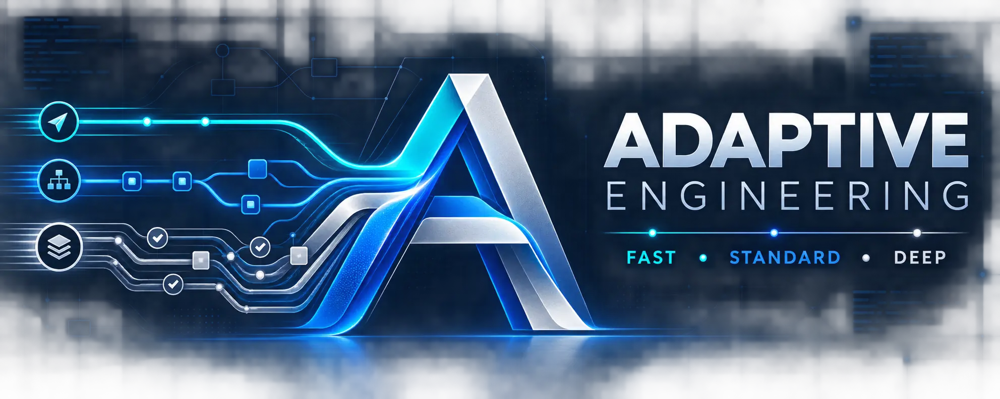

# Adaptive Engineering

<p align="center">
  
</p>

<p align="center">
  <strong>Adaptive software-engineering workflows for AI coding agents.</strong>
</p>

<p align="center">
  <a href="https://github.com/neuraforge-cl-es/adaptive-engineering/releases/tag/v0.3.0">
    
  </a>
  <a href="https://github.com/neuraforge-cl-es/adaptive-engineering/actions/workflows/validate.yml">
    
  </a>
  <a href="LICENSE">
    
  </a>
  
</p>

> **Use the least process necessary to produce the simplest correct, verified solution.**

Adaptive Engineering gives AI coding agents a simple decision:

- use **FAST** when the change is local, low-risk, and reversible;
- use **STANDARD** when normal software-engineering discipline is needed;
- use **DEEP** when failure is expensive, difficult to reverse, or affects critical systems.

The agent should normally select the appropriate mode automatically. Explicit commands are available when you want to override that decision.

---

## Why Adaptive Engineering?

AI coding agents are often pushed toward one of two extremes:

- too little engineering discipline for risky changes; or
- too much ceremony for simple changes.

Adaptive Engineering adjusts the workflow to the **risk, scope, ambiguity, reversibility, and blast radius** of the task.

A one-line change can be **DEEP** if getting it wrong can compromise authentication, production infrastructure, data integrity, or a public contract.

A much larger change can still be **FAST** when it is isolated, reversible, and easy to verify.

## How it works

| Mode | Use for | Workflow |
|---|---|---|
| **FAST** | Local, low-risk, reversible work | inspect → reuse → minimal change → verify → simplify |
| **STANDARD** | Features, bugs, subsystem refactors | inspect → criteria → budget → implement/test → simplify → verify |
| **DEEP** | Security, data, public contracts, CI/CD, infrastructure, distributed or high-risk changes | constraints → failures → trade-offs → staged plan → implement/test → review → simplify → E2E verify |

Every mode preserves the same core principles:

**inspect first · reuse before adding · minimize complexity · verify with evidence · simplify before completion**

## Quick start

Clone the repository:

```bash
git clone https://github.com/neuraforge-cl-es/adaptive-engineering.git
cd adaptive-engineering
```

Validate the repository:

```bash
python3 scripts/validate.py
```

Python 3.11 or newer is required. No third-party Python packages are needed.

### Cursor

Install globally for the current user:

```bash
./scripts/install-local.sh
```

Then run **Developer: Reload Window** and confirm Adaptive Engineering is enabled under Cursor plugins.

### Claude Code

```text
/plugin marketplace add https://github.com/neuraforge-cl-es/adaptive-engineering
/plugin install adaptive-engineering@neuraforge-plugins
```

### Gemini CLI

For local development:

```bash
gemini extensions link "$(pwd)"
```

Install the released version directly from GitHub:

```bash
gemini extensions install https://github.com/neuraforge-cl-es/adaptive-engineering --ref v0.3.0
```

For ChatGPT / Codex, Google Antigravity, Agent Plugins 1.0, and OpenCode, see the complete [installation instructions](docs/INSTALLATION.md).

## Platform support

| Platform | Integration | Status |
|---|---|---|
| **Cursor** | `.cursor-plugin/plugin.json`, rules, skills, agents, Markdown commands | Native |
| **Claude Code** | Plugin and marketplace manifests | Native |
| **ChatGPT / Codex** | `.codex-plugin/plugin.json` and portable skills | Native |
| **Gemini CLI** | Extension manifest, context, skills, agents, TOML commands | Native |
| **Google Antigravity** | Generated plugin with skills, rule, agents, and canonical core | Build target |
| **Agent Plugins 1.0** | Generated portable package | Build target |
| **OpenCode** | Generated `.opencode/skills` adapter | Build target |

See the complete [platform matrix](docs/PLATFORMS.md).

## Included components

### Skills

Adaptive Engineering ships with nine shared engineering skills:

- `adaptive-engineering`
- `task-triage`
- `existing-system-scan`
- `minimal-planning`
- `verified-implementation`
- `systematic-debugging`
- `simplification-gate`
- `verification`
- `code-review`

### Agents

Four specialist agents are included:

- `adaptive-architect`
- `adaptive-builder`
- `adaptive-reviewer`
- `adaptive-simplifier`

### Commands

Six explicit workflow commands are available:

- `/fast`
- `/standard`
- `/deep`
- `/triage`
- `/simplify`
- `/review`

Commands are overrides and tools, not mandatory ceremony.

## Architecture

Adaptive Engineering keeps the methodology separate from individual AI platforms.

`core/` is the canonical, host-agnostic source:

```text
core/
├── PRINCIPLES.md
├── METHODOLOGY.md
├── spec.json
└── workflows/
    ├── fast.md
    ├── standard.md
    └── deep.md
```

Platform-specific integrations are thin adapters around that shared core.

```text
                ┌─────────────────────┐
                │        core/        │
                │ canonical method    │
                └──────────┬──────────┘
                           │
          ┌────────────────┼────────────────┐
          │                │                │
       skills/          agents/         commands/
          │                │                │
          └────────────────┼────────────────┘
                           │
       ┌──────────┬────────┼────────┬──────────────┐
       │          │        │        │              │
     Cursor     Claude   Codex    Gemini      Antigravity
```

This avoids maintaining independent copies of the methodology for every host.

## Verification

Run the complete repository validation:

```bash
python3 scripts/validate.py

python3 scripts/build-agent-plugin.py
python3 scripts/build-antigravity.py
python3 scripts/build-opencode.py

python3 scripts/validate.py --dist
```

GitHub Actions runs the same validation automatically on pushes and pull requests.

The validation covers:

- native platform manifests;
- generated adapters;
- canonical skills and methodology;
- Antigravity plugin layout;
- Cursor install/uninstall behavior.

## Design principles

Adaptive Engineering deliberately keeps its operational surface small:

- **No MCP server required** — the methodology does not require network tools.
- **No mandatory subagents** — delegation is useful only when work separates cleanly.
- **No external runtime dependencies** — the core remains portable.
- **No process for process's sake** — workflow depth must be justified by task risk.
- **No lowering safety to fit a mode** — security, integrity, compatibility, and production-critical verification always take precedence.

## Documentation

Start with:

- [Installation](docs/INSTALLATION.md)
- [Platform support](docs/PLATFORMS.md)
- [Methodology overview](docs/METHODOLOGY.md)
- [Behavioral test scenarios](docs/TEST-SCENARIOS.md)
- [Contributing](CONTRIBUTING.md)
- [Security policy](SECURITY.md)
- [Changelog](CHANGELOG.md)

## Contributing

Contributions are welcome.

Please read [CONTRIBUTING.md](CONTRIBUTING.md) before opening a pull request.

All changes to `main` go through pull requests and automated validation.

For security-sensitive reports, follow [SECURITY.md](SECURITY.md) rather than opening a public issue.

## License

Adaptive Engineering is released under the [MIT License](LICENSE).

---

<p align="center">
  <strong>Adaptive Engineering</strong><br>
  Engineering discipline that adapts to the risk of the change.<br><br>
  by Neuraforge
</p>
